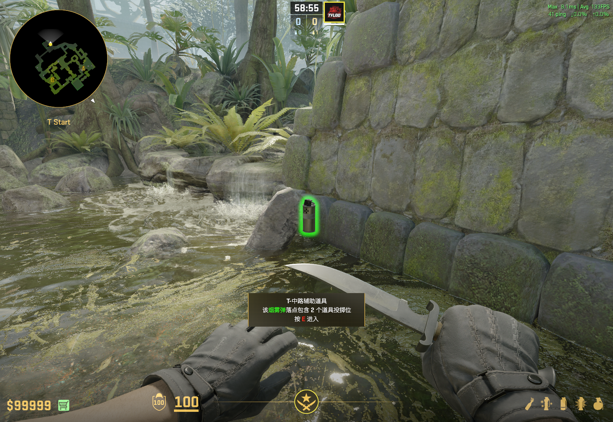
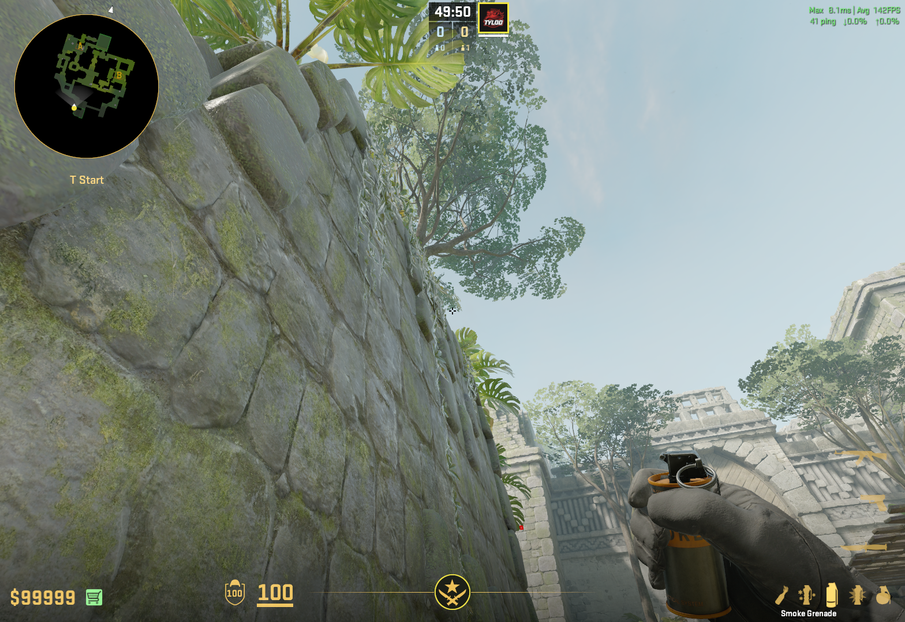
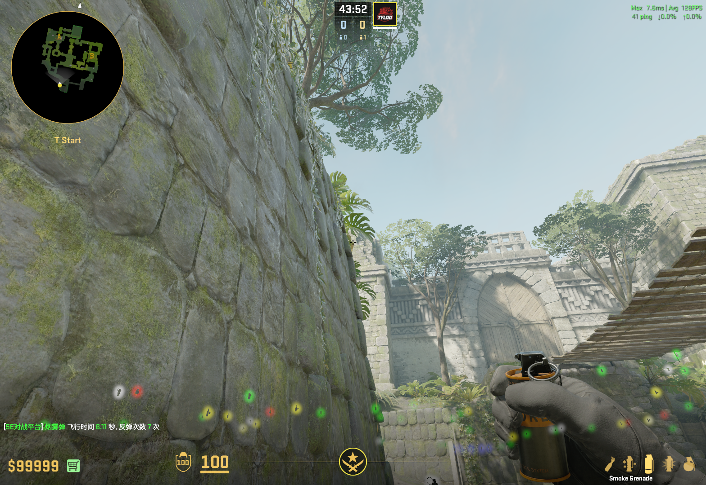
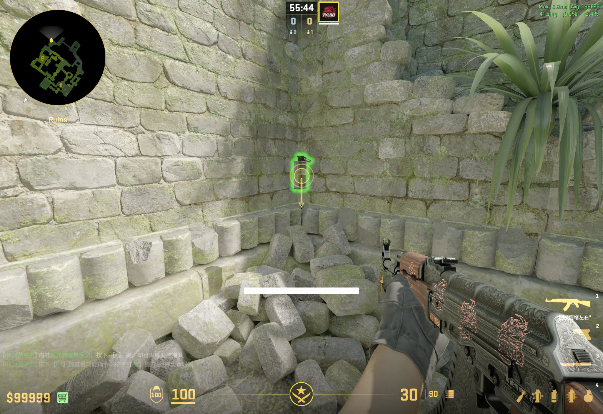
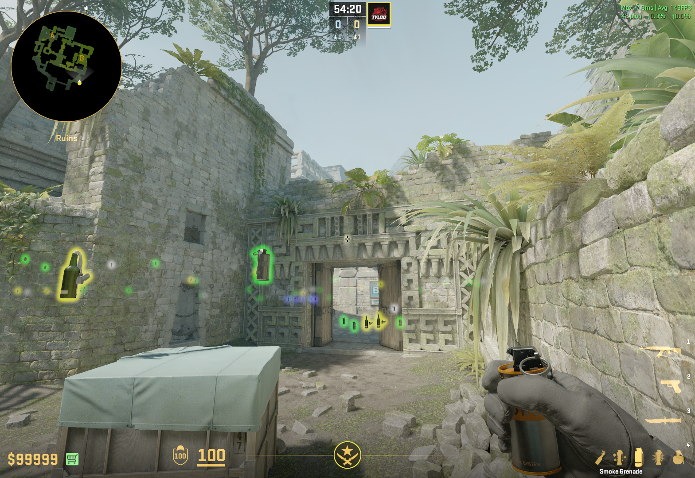
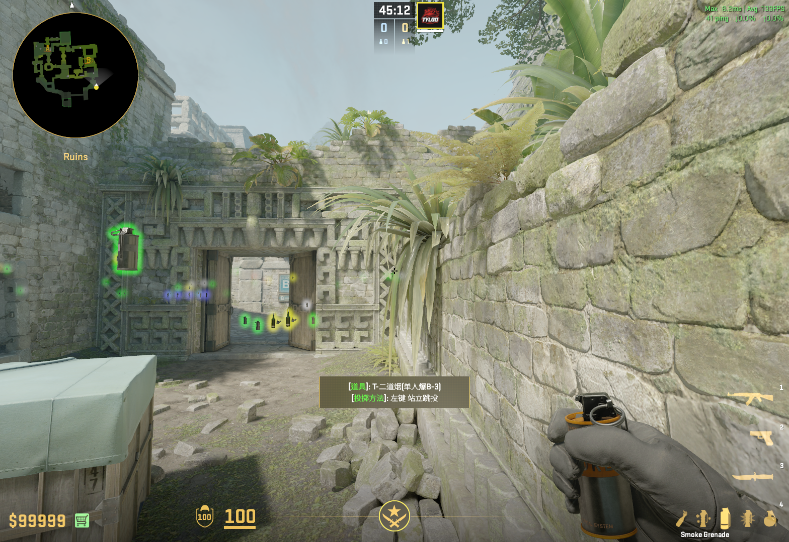
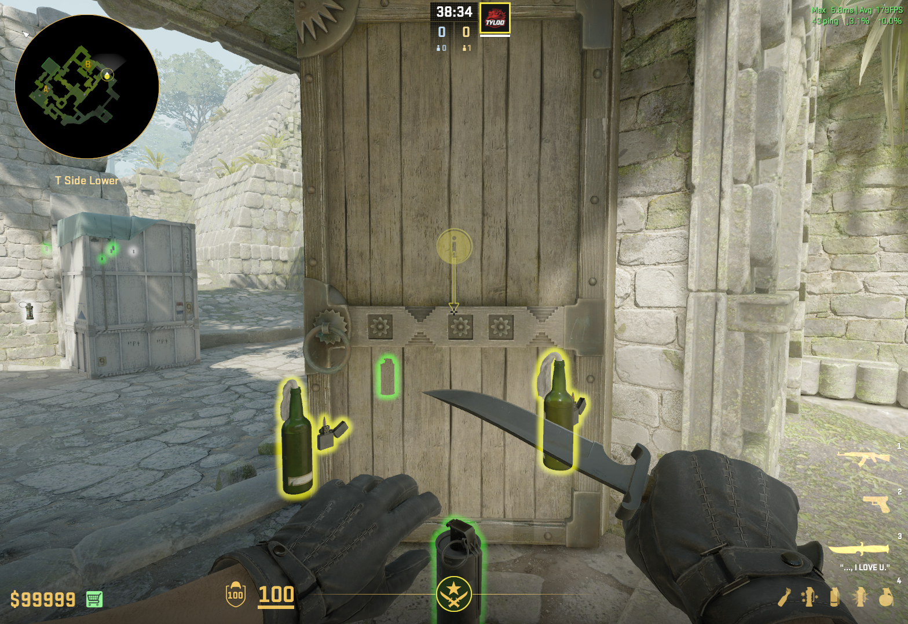
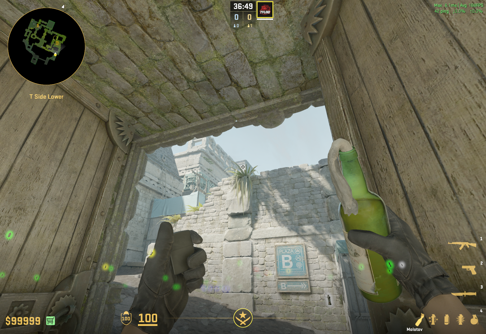
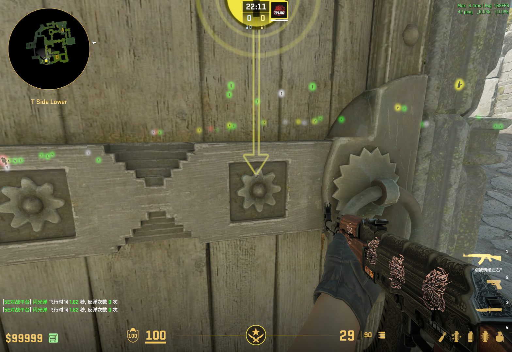
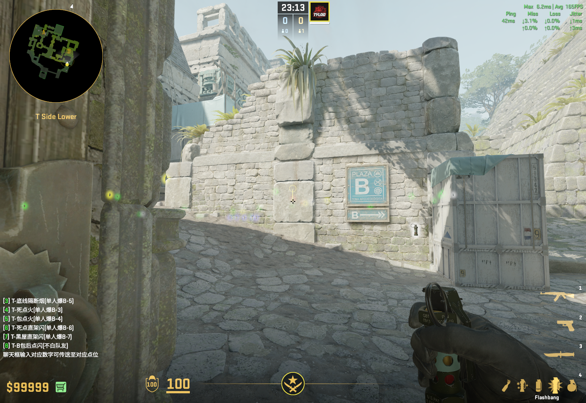

<!--  -->

## T

### A点

#### 甜甜圈 + 警家烟 1

>匪家爆弹，适合提速。

站位：

甜甜圈烟：瞄准树叶底部中间，水平轴跑到下方叶子底部（红点标记处）跳投，8s左右爆开。

警家烟：瞄准黄色叶子右上，跑一步跳投，6s左右爆开。

### B点

#### 常规一二道烟

站位：

一道烟：瞄准石头光斑处跳投，4-5s爆开。

二道烟：瞄准三角形上端跳投，5-6s爆开。

#### 包点火
站位：大概抵住右门，稍微靠左一点点。

瞄准两长树叶中间直接投掷即可。

## 闪光

包点后闪光：白远点一二道，爆在包点柱子后，不白启动队友。

站位：抵住左门偏前，防止跳投被门框挡住。

瞄准石块中间跳投。

### 中路