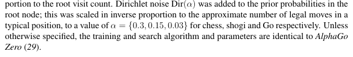

源码近期让AI整理一下再上传到GitHub吧，自己的文件结构略微有些混乱......不过效果还是不错的~

## 知识背景

### 蒙特卡洛方法

>蒙特卡洛方法(Monte Carlo method)，是一种“统计模拟方法”。20世纪40年代，为建造核武器，冯.诺伊曼 等人发明了该算法。因赌城蒙特卡洛而得名，暗示其以概率作为算法的基础。  
>假设我们要计算一个不规则形状的面积，我们只需在包含这个不规则形状的矩形内，随机的掷出一个点，每掷出一个点，则N+1，如果这个点在不规则图形内则W+1。落入不规则图形的概率即为 W/N。当掷出足够多的点之后，我们可以认为：不规则图形面积＝矩形面积＊W/N。

### 蒙特卡洛树搜索(MCTS)

>1987年Bruce Abramson在他的博士论文中提出了基于蒙特卡洛方法的树搜索这一想法。这种算法简而言之是用蒙特卡洛方法估算每一种走法的胜率。如果描述的再具体一些，通过不断的模拟每一种走法，直至终局，该走法的模拟总次数N，与胜局次数W，即可推算出该走法的胜率为 W/N。通过随机的对游戏进行推演来逐渐建立一棵不对称的搜索树的过程。

一些写的很好的文章，都介绍了基础的MCTS：  

- [【最佳实战】蒙特卡洛树搜索算法](https://zhuanlan.zhihu.com/p/333348915)  
- [基于MCTS的黑白棋ai](https://www.sunnycandy.fun/post/other/Othello/)  

直观地说，我们平时下棋有时也会考虑我们下了这步棋后，对手**大概率**会怎么下，这样下后的局面又会如何，我们总不能臆想对手下一步非常不好的棋。此外，这里涉及到非常重要的一个概念：**视角**。

当我们有多个落子位置可选时，当然会希望选择胜率最大的位置，同样，对手也会希望选择他胜率最大的位置。首要的问题是，我们该如何确定这个胜率？

蒙特卡洛的核心思想是概率，用模拟来推断实际，我们可以在当前的棋盘状态下进行一定数量的模拟对局(rollout)，用他们终局的胜负或者其他合理的评判标准（如黑白棋的棋子数差）来给出当前节点的先验胜率or先验价值。

为了让模拟更有意义，我们需要有方向的模拟，也就是在下一步中，在对方的视角下，我们希望模拟对方胜率较高的落子，重要的是，对这些落子模拟的结果，也会实时的更新父节点的胜率/价值上，这是MCTS全局和局部结合的关键：只要树探索到了底部（叶子），就开始rollout模拟，然后将结果回传给上层节点，更新这些节点的胜率/平均价值估计。最终在当前需要落子的节点下，给出胜率/平均价值最高的落子。

*还有一些细节需要注意：实际上在选择节点模拟时不单单要看胜率，还要考虑探索性exploration，所以说往往在选择阶段MCTS都要用到UCT公式，这个公式综合考虑了胜率和探索性，从而在选择节点时，既能选择胜率高的节点，也能选择一些访问次数较少的节点进行探索。*

>提取并总结一下，选择阶段的作用是：选择出一条未来更可能发生的路径。
>而拓展、模拟、反向传播三个阶段则是通过这条路径，对第一级子节点的胜率进行调整，参入对敌我动向的分析，使该胜率更可信。

### MCTS with NN

TBH, 基础的MCTS在这次的黑白棋中已经表现的很厉害了，在模拟400步时，我和它下棋就已经很吃力了（当然我水平也有限，甚至可以说和他下棋我也学到了很多）。在mo平台的测试中，基础的mcts在模拟1000步的情况下也是顺利击败了高级玩家。


但是，总觉得它还不够智能，虽然MCTS的算法非常美妙，也并非全部依靠rollout来评估局面，但一是耗时较多，二是通过模拟很多局来获得所谓局面评估，这与人类的“棋感”还是有差距的。于是乎，神经网络可以登场了：通过输入此时棋盘的状态，输出所有的合法动作进行量化的评估价值，选择价值高的落子，这是我开始的直观想法，后来阅读材料后发现这叫raw network并且当时实际上AlphaGo也尝试用了raw network，效果也很好，不过震惊世界的AlphaGo Zero的核心算法其实是把神经网络和MCTS结合起来，MCTS可以被理解为一个强有力的策略改善的过程。

普通的MCTS在到达叶节点时，进行rollout模拟来评估局面，而结合神经网络的MCTS则是用神经网络来评估局面，从而大大提升了评估的效率。具体来说，神经网络会输出两个值：一个是策略向量，表示每个合法动作的概率分布；另一个是价值标量，表示当前局面的期望结果。在选择叶节点时，用到类似于UCT的评判公式PUCT：
$$
a_t = \arg\max_a \left( Q(s,a) + c_{puct} \cdot P(s,a) \cdot \frac{\sqrt{N(s)}}{1 + N(s,a)} \right)
$$ 
，同样是平衡了探索性和利用性。

而神经网络的训练数据，则是来源于自我对弈产生的三元组 (s_t, π_t, z)，其中 s_t 是当前局面，π_t 是MCTS搜索得到的动作分布，z 是最终的游戏结果。训练的损失函数包括价值损失、策略损失和L2正则化:
$$
L = (z - v)^2 - \boldsymbol{\pi}^\top \log \mathbf{p} + c\|\theta\|^2
$$ 

在深入到技术细节之前，最后再用我的理解表达一下MCTS with NN究竟是怎么工作的：

首先是自对弈收集数据到数据(s, π, z)三元组，s表示当前的局面状态，π表示用当前的网络进行mcts后得到的各个动作的访问概率分布，z表示最终的胜负结果。

然后把这些数据放到神经网络进行训练，开始神经网络是随机初始化的，所以此时的价值和策略都是在随机预测，那么模拟出来的对局基本等同于随机对局（有一点rollout的感觉），**但是由于就算是随机模拟，其胜负结果也是有意义的**，模型在价值的预测上会慢慢准确，从而在选择阶段也会慢慢多选那些终局是胜利（价值高）的情况，同时也会促使模型在策略上学习（因为输出的策略不再那么的随机），于是给出的先验概率越来越具有参考意义。整体来看，这是一个不断循环，相辅相成的过程。

## 技术细节

### 棋盘状态编码

```python
# policy_value_net.py

def encode_board(board, color):
    """
    将棋盘编码为 3 个 8×8 平面
    """
    opp = 'O' if color == 'X' else 'X'
    state = np.zeros((3, 8, 8), dtype=np.float32)

    for x in range(8):
        for y in range(8):
            c = board._board[x][y]
            if c == color:
                state[0, x, y] = 1.0      # 平面0：我方棋子
            elif c == opp:
                state[1, x, y] = 1.0      # 平面1：对方棋子

    if color == 'X':
        state[2, :, :] = 1.0              # 平面2：是否是黑棋视角

    return state
```

### 自对弈

黑白棋、五子棋、围棋这类游戏都有着对称性，所以我们可以增强数据集：

```python
def get_equi_data(self, play_data):
    """数据对称增强2*4=8"""
    extend_data = []
    for state, mcts_prob, winner in play_data:
        state = np.array(state)
        mcts_prob = np.array(mcts_prob)

        for i in range(4):
            equi_state = np.array([np.rot90(s, i) for s in state])
            equi_prob = np.rot90(mcts_prob, i)
            extend_data.append((equi_state, equi_prob, winner))

            equi_state_flip = np.array([np.fliplr(s) for s in equi_state])
            equi_prob_flip = np.fliplr(equi_prob)
            extend_data.append((equi_state_flip, equi_prob_flip, winner))

    return extend_data
```

可以看到，state和prob同时旋转翻转，winner保持不变。


假设一盘棋走了 5 步，黑棋(X)赢了：

| 步骤 | 执行者 | 状态 | MCTS概率分布 | 最终结果 |
|------|--------|------|--------------|----------|
| 1    | X      | s₁   | π₁           | z=+1     |
| 2    | O      | s₂   | π₂           | z=-1     |
| 3    | X      | s₃   | π₃           | z=+1     |
| 4    | O      | s₄   | π₄           | z=-1     |
| 5    | X      | s₅   | π₅           | z=+1     |

> 共享同一盘棋的结果

原始数据: 5 个三元组  
增强后:   5 × 8 = 40 个训练样本


### 数据流AI总结

| 阶段 | 操作 | 输出格式 |
|------|------|----------|
| **状态编码** | `encode_board(board, color)` | `(3, 8, 8)` 张量 |
| **MCTS搜索** | `mcts.get_move_probs(...)` | `(8, 8)` 概率分布 |
| **记录执棋方** | `player = color` | `'X'` 或 `'O'` |
| **游戏结束** | 根据胜负填充 z | `+1 / -1 / 0` |
| **数据增强** | 旋转4次 × 翻转2次 | 8倍扩增 |
| **单局产出** | 约40步 × 8倍增强 | ≈320条数据 |
| **数据格式** | `(state, prob, z)` | `((3,8,8), (8,8), float)` |
| **缓冲区** | 最大容量20000条 | FIFO淘汰旧数据 |
| **训练采样** | `random.sample(buffer, 512)` | 512条/批次 |

### PUCT公式

PUCT（Predictor Upper Confidence Bound applied to Trees）是 AlphaGo/AlphaZero 中用于节点选择的核心公式，它在传统 UCT 的基础上引入了神经网络的先验概率。

#### 定义
$$
a_t = \arg\max_a \left( Q(s,a) + U(s,a) \right)
$$
其中探索项 U 定义为：

$$
U(s,a) = c_{puct} \cdot P(s,a) \cdot \frac{\sqrt{N(s)}}{1 + N(s,a)}
$$

#### 符号说明

| 符号 | 含义 | 来源 |
|------|------|------|
| $Q(s,a)$ | 动作 a 的平均价值估计 | MCTS 搜索统计 |
| $P(s,a)$ | 动作 a 的先验概率 | 神经网络策略输出 |
| $N(s)$ | 父节点的访问次数 | $\sum_b N(s,b)$ |
| $N(s,a)$ | 子节点的访问次数 | MCTS 搜索统计 |
| $c_{\text{puct}}$ | 探索常数 | 超参数，通常取 1~5 |

#### 两项的理解
```
score = Q(s,a) + U(s,a)
        ├─────┘   └─────┘
        利用项     探索项
```   

利用项 Q(s,a)： 

- 该动作历史上的平均回报（注意，回报也是神经网络预测的胜负）
- 倾向于选择已知的好动作

探索项 U(s,a)：   

- 鼓励尝试访问次数少的动作
- P(s,a) 大 → 神经网络认为这是好棋 → 优先探索
- N(s,a) 小 → 访问次数少 → 值得探索
- N(s) 大   → 父节点访问多 → 该多探索子节点了

#### AI生成的动态行为演示

假设某节点有 3 个子动作，初始状态：
```
初始 (N_parent = 0):
┌────────┬───────┬───────┬───────┬───────┬─────────┐
│ Action │ P(s,a)│ N(s,a)│ Q(s,a)│   U   │  Score  │
├────────┼───────┼───────┼───────┼───────┼─────────┤
│   A    │  0.6  │   0   │   0   │  ∞    │   ∞     │ ← 先选 P 最大的
│   B    │  0.3  │   0   │   0   │  ∞    │   ∞     │
│   C    │  0.1  │   0   │   0   │  ∞    │   ∞     │
└────────┴───────┴───────┴───────┴───────┴─────────┘

模拟 10 次后 (假设 c_puct=5):
┌────────┬───────┬───────┬───────┬───────┬─────────┐
│ Action │ P(s,a)│ N(s,a)│ Q(s,a)│   U   │  Score  │
├────────┼───────┼───────┼───────┼───────┼─────────┤
│   A    │  0.6  │   6   │  0.3  │ 1.37  │  1.67   │
│   B    │  0.3  │   3   │  0.5  │ 1.19  │  1.69   │ ← Q 高，开始胜出
│   C    │  0.1  │   1   │ -0.2  │ 0.79  │  0.59   │
└────────┴───────┴───────┴───────┴───────┴─────────┘

模拟 100 次后:
┌────────┬───────┬───────┬───────┬───────┬─────────┐
│ Action │ P(s,a)│ N(s,a)│ Q(s,a)│   U   │  Score  │
├────────┼───────┼───────┼───────┼───────┼─────────┤
│   A    │  0.6  │  30   │  0.25 │ 0.97  │  1.22   │
│   B    │  0.3  │  60   │  0.55 │ 0.24  │  0.79   │
│   C    │  0.1  │  10   │ -0.1  │ 0.45  │  0.35   │
└────────┴───────┴───────┴───────┴───────┴─────────┘
                              ↑
                    U 项衰减，Q 项主导选择
```

### 探索机制

#### 温度采样

MCTS 搜索结束后，每个动作有一个访问次数 $N(a)$。如何从中选择动作？
$$
\pi(a) = \frac{N(a)^{1/\tau}}{\sum_b N(b)^{1/\tau}}
$$

其中 $\tau$ 是温度参数。

```python
temp = 1.0 if move_count < temp_threshold else 1e-3
```

举个例子就理解了：假设有 3 个动作，访问次数分别为 $N = [100, 50, 10]$：

| 温度 τ | 计算过程 | 概率分布 π | 特点 |
|--------|----------|------------|------|
| τ → ∞ | $N^0 = [1,1,1]$ | [0.33, 0.33, 0.33] | 完全均匀 |
| τ = 1 | $N^1 = [100, 50, 10]$ | [0.625, 0.3125, 0.0625] | 按比例 |
| τ → 0 | $N^∞$ | [1, 0, 0] | 确定性选择最大 |

也就是说，在前面30步时（`temp_threshold=30`），temp=1，实际走的是按比例采样，增加探索性；而在后面时，temp趋近于0，基本上选择访问次数最多的动作，保证利用性，以防在开局阶段太过雷同。

```python
# mcts_nn.py

def get_move_probs(self, board, color, temp=1.0, self_play=False):
    # ... MCTS 搜索完成后 ...
    
    visits = np.array(visits, dtype=np.float32)

    if temp < 1e-3:
        # 低温：直接选最大
        best_idx = np.argmax(visits)
        probs = np.zeros_like(visits)
        probs[best_idx] = 1.0
    else:
        # 高温：按比例采样
        # 使用 log 技巧避免数值溢出
        log_visits = np.log(visits + 1e-10)
        log_visits_scaled = log_visits / temp
        log_visits_scaled = log_visits_scaled - np.max(log_visits_scaled)  # 数值稳定
        probs = np.exp(log_visits_scaled)
        probs = probs / probs.sum()
    
    # 按概率采样动作
    if temp < 1e-3:
        move = acts[np.argmax(probs)]
    else:
        move = np.random.choice(acts, p=probs)
```

#### Dirichlet噪声

原文：


在**根节点**的先验概率 $P(s,a)$ 上添加噪声：
$$
P'(s,a) = (1 - \varepsilon) \cdot P(s,a) + \varepsilon \cdot \eta_a
$$

其中：  
- $\varepsilon$ 是噪声权重，通常取 0.25  
- $\eta \sim \text{Dir}(\alpha)$ 是 Dirichlet 分布采样的噪声  

**为什么只在根节点加噪声**？

AI生成的，说的很好：
```
┌─ root (加噪声) ─────────────────────────────────┐
│  这里决定了这一步走哪里                          │
│  需要探索"神经网络可能没想到"的走法              │
├─────────────────────────────────────────────────┤
│  ├── child_1 (不加噪声)                         │
│  │   └── ...                                    │
│  ├── child_2 (不加噪声)                         │
│  │   └── ...                                    │
│  └── child_3 (不加噪声)                         │
│      └── ...                                    │
│                                                 │
│  子节点代表对手或未来的自己                      │
│  我们假设他们会"理性"地下棋                      │
│  不需要人为加噪声                               │
└─────────────────────────────────────────────────┘
```

#### 两者的区别与互补

| 特性 | Dirichlet 噪声 | 温度采样 |
|------|----------------|----------|
| 作用位置 | MCTS 搜索之前 | MCTS 搜索之后 |
| 影响对象 | 先验概率 P(s,a) | 访问分布 N(a) |
| 目的 | 让搜索探索更多分支 | 让选择更加随机 |
| 何时使用 | 仅自对弈 | 仅自对弈 |
| 随步数变化 | 不变 | 前30步高温，之后低温 |


