# 梳理一

## R、L、C元件
### 电阻元件（Resistor，R）
1. 概念：电阻元件是一个二端元件，表现为能量消耗。电阻反映了电流在通过元件时所消耗的功率。
2. 数学关系：
   $$
   U = IR
   $$
   其中，$ U $ 为电压，$ I $ 为电流，$ R $ 为电阻值。

### 电感元件（Inductor，L）
1. 概念：体现磁场储能的二端元件：通过变化的电流产生变化的磁场。
2. 数学关系：
   $$
   u(t) = L \frac{di(t)}{dt}
   $$
   其中，$ u(t) $ 为电感两端的电压，$ L $ 为电感量，$ \frac{di(t)}{dt} $ 为电流的变化率。

### 电容元件（Capacitor，C）
1. 概念：体现电场储能的二端元件：通过极板间的电场储存电能。
2. 数学关系：
   $$
   i(t) = C \frac{du(t)}{dt}
   $$
   其中，$ i(t) $ 为流过电容的电流，$ C $ 为电容值，$ \frac{du(t)}{dt} $ 为电压的变化率。

## [图论](../elec/docs/graph.pdf)
由于基尔霍夫定律中也涉及到回路、网孔等图论概念，所以提前梳理图论内容以铺垫后续内容理解。

## KVL/KCL
### 参考方向的选取

电压、电流均为**代数值**，其正负是与选定参考方向相对应的。离开参考方向，只讲电压、电流的正负是不完整的，所以电路中电压、电流的描述和计算都必须在选定参考方向后进行。

### 基尔霍夫电流定律（KCL）
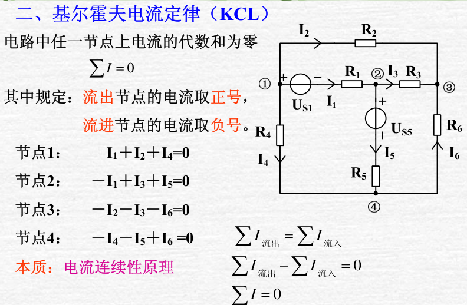
**拓展：**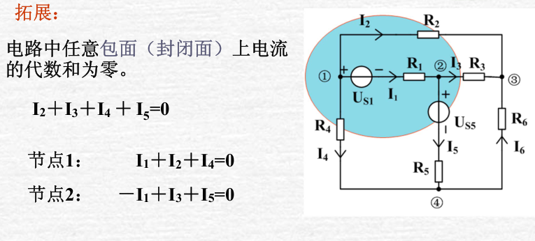

!!! note "广义节点"
    我们可以把这种封闭面称之为广义节点，流入该封闭面和流出该封闭面的电流相等。  
    很多时候，当我们不关心某一封闭面内部的电流时，可以选取该封闭面为广义结点，列写KCL方程。

!!! example "例子：求电流 $I$ "
    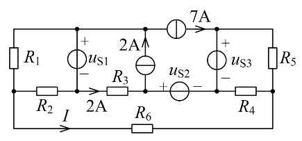
    ??? tip "解答"
        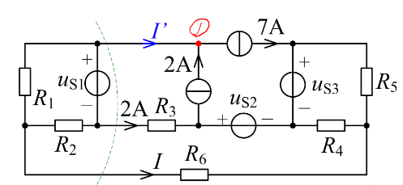
        
        对节点1列写KCL得到 $I^\prime=5A$;  
        对虚线所示闭合曲面列写KCL得到 $I=-7A$  

    
    
    
### 基尔霍夫电压定律（KVL）
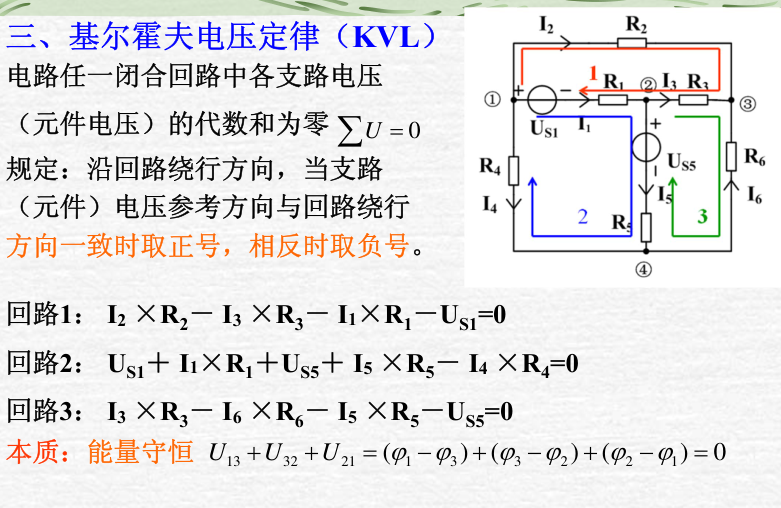
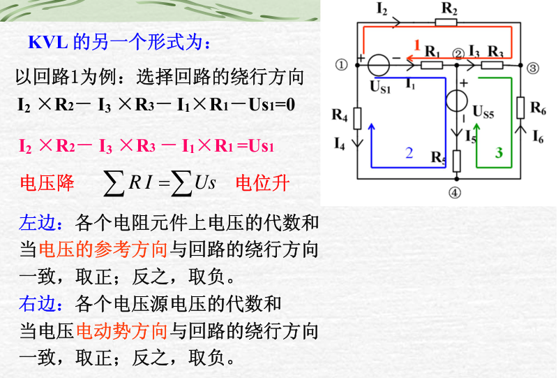

!!! note "电路中任意两点间的电压等于两点间任一条路径经过的各元件电压的代数和。"

## 无源一端口的等效
### 电阻的串并联
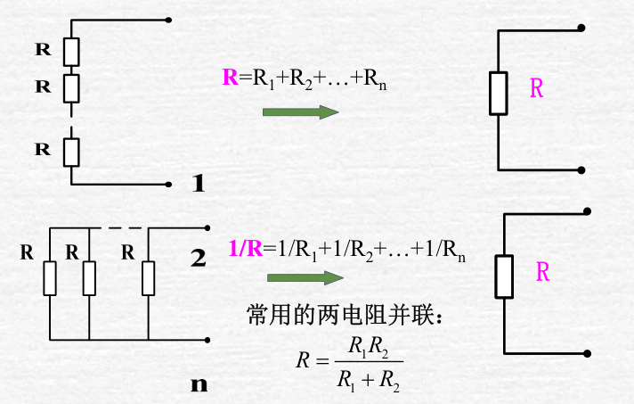
### 平衡电桥
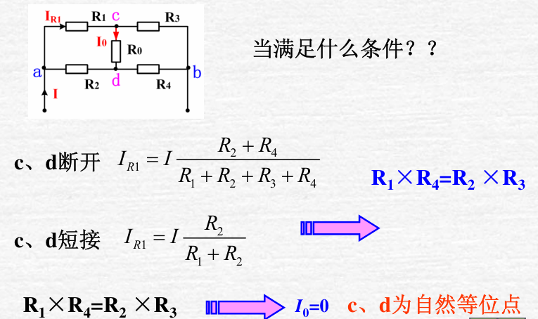
### 电路的对称性
!!! example "例子"
    

###  Y-△变换（重要）
推导内容较多，可以右键放大图片来看：

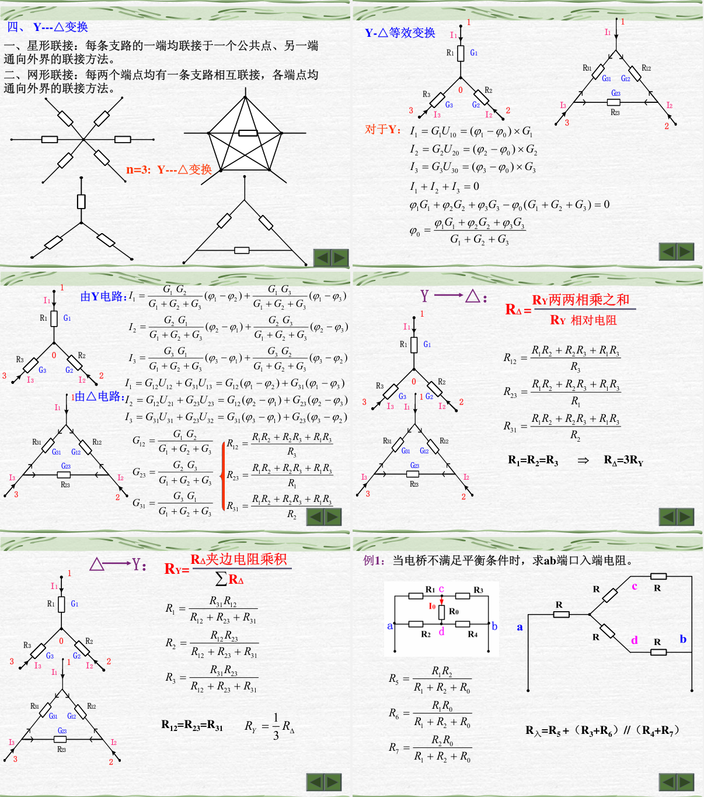

!!! note "如上图最后一张PPT，非平衡电桥是该变换的重要应用之一。"
## 有源一端口的等效
### 电压源、电流源的串并联
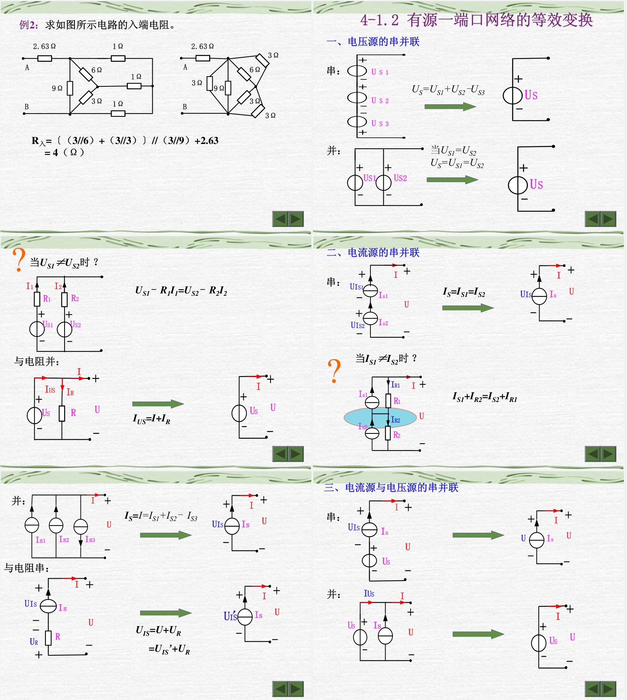

!!! note "本质仍然是基尔霍夫定律。"
### 实际电压源和电流源的等效变换
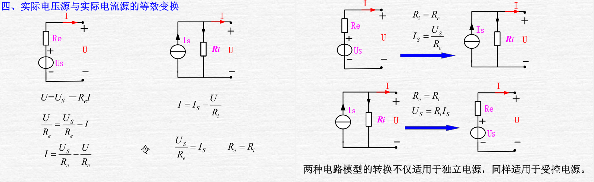
## [电路分析的电流方法](docs/branch.pdf)
此部分内容较好理解，故将PPT放在上方链接出，下面仅给出注意事项。
### 支路电流法
容易理解，根据KCL和KVL列写方程即可。
### 回路电流法
>选择支路电流参考方向，选择树，尽可能将电流源所在支路选为连支，画出单连支回路。

这句话可以说是回路电流方法的精髓了，不同于网孔电流不用选择回路，仅需设出网孔的电流，回路电流法需要选择能够简化计算，信息更清楚的回路，当我们选择含有电流源的回路时，目的是让该回路电流直接等于电流源电流，这与我们其他回路的选择有关。

!!! example "例子"
    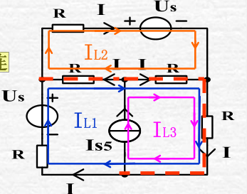  

如上图，这里的L3回路即做到了上述要求，这就需要我们L1回路不能通过电流源(若通过即等效于网孔电流法)，在某些电路较复杂，网孔电流法方程较多的情况下，通过观察选择适当的回路可以方便计算。
### 网孔电流法
容易理解，需要注意的是仅适用于平面电路。

## 电路分析的电压方法
### 节点电压法
**节点电压：**
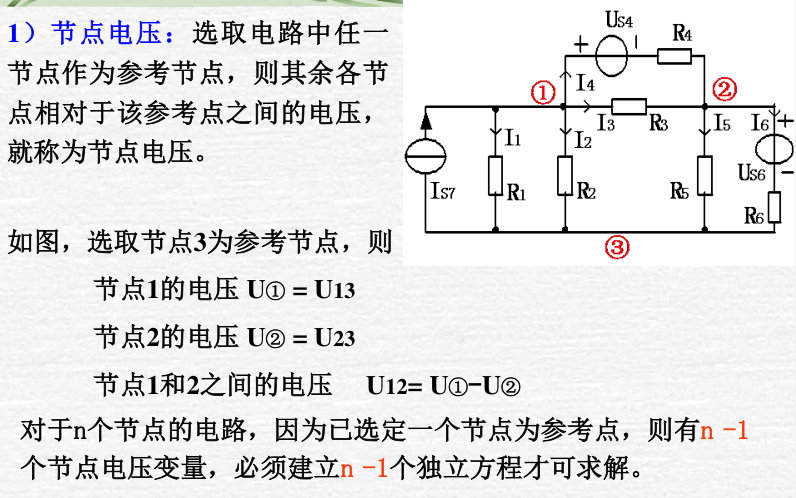

**节点电压法的推导：** 可略看，稍后会给出更好的理解。
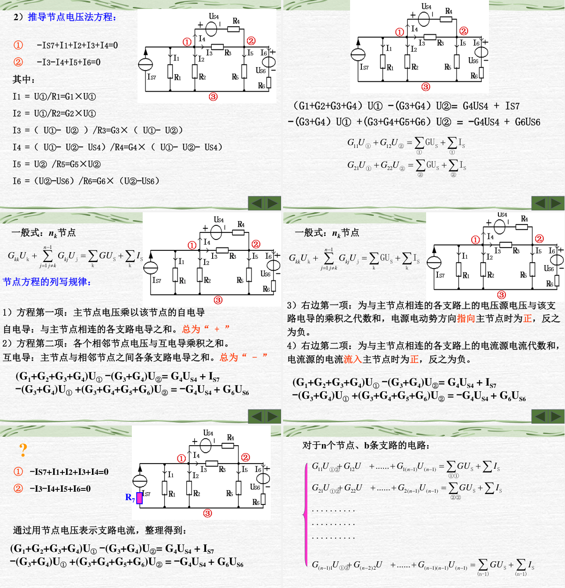

!!! note "节点电压法本质是电路的KCL方程"
    [参考资料](https://zhuanlan.zhihu.com/p/593076630)  
    方程的左边是电流的流出，这里的流出指的是把流出主节点的方向看作电流的参考方向，那计算流出必然是主节点的电压减去其他节点的电压除以电阻。  

    而方程的右边是电流的流入，电流源那里很好理解，因为本质是KCL方程，所以与电流源串联的电阻不在方程左边的考虑范围内，那为什么和电压源串联的电阻就要考虑呢？  

    实际上，我们可以把电压源与电阻串联等效为电流源和电阻并联，等效的原理见[前文](review_1.md/#_10)。这样也就解释了为什么等式左边要计算和电压源串联的电阻，它实质上等效为和等效电流源并联的支路的电流；以及等式右边电压源电压与该支路电导的乘积便可以理解为等效电流源的电流。