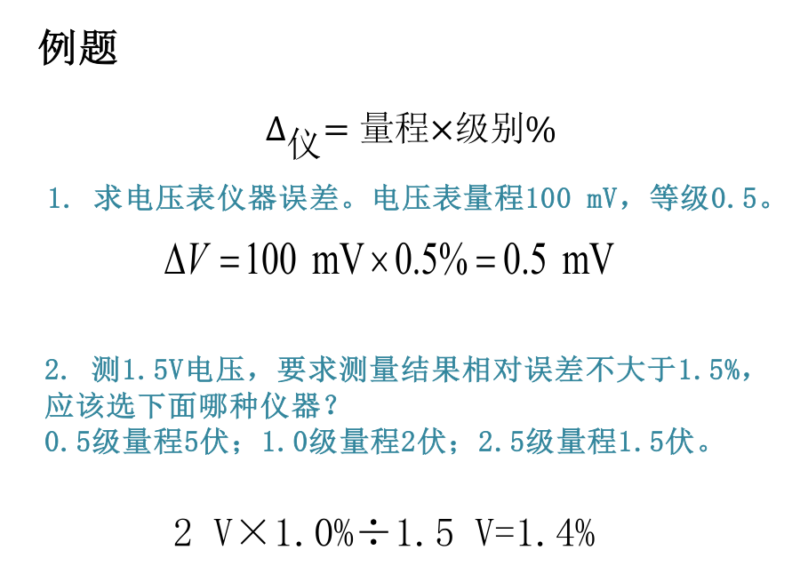
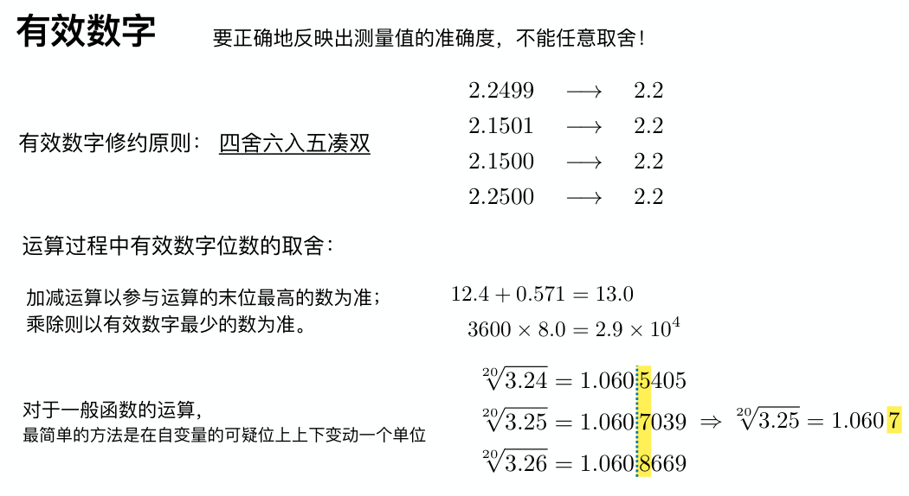

## 实验测量
### 关于测量
- **直接测量**：所要测量的量不必将实测的量经过任何函数关系的计算而直接得到。
- **间接测量**：通过欲测量的量与直接实测的量之间的已知函数关系，经过计算间接得到欲测量的量。

### 有效位数

- **可靠数字**：通过直读获得的准确数字。
- **存疑数字**：通过估读得到的数字。
- **有效数字和有效位数**：测量值的可靠数加上一位存疑数的全部数字称为有效数字。其总位数称为该测量的有效位数。

!!! note "例子"
    {:height="60%" width="60%"}

### 各种仪器的使用方法（待更新）

## 实验误差
### 误差表示

1. 绝对误差=测量结果-被测量的真值
2. 相对误差（百分误差）：
$$
E = \frac{\left| \text{测量值} - \text{真值} \right|}{\text{真值}} \times 100\%
$$
3. 标准误差（标准差）：
$$
S = \sqrt{\frac{1}{n-1} \sum_{i=1}^{n} |\text{绝对误差}|^2}
$$
[为什么分母是 $n-1$ 不是 $n$ ?](https://zhuanlan.zhihu.com/p/102043269)

### 误差分类
{:height="80%" width="80%"}

!!! note "例子"
    {:height="60%" width="60%"}

### 随机变量的统计规律（待更新）
这段可能学了概统再更新~

## 实验数据处理
### 不确定度
- 不确定度表示由于测量误差存在而对被测量值不能确定的程度。不确定度是一定概率下的误差限值。
- 不确定度反映了可能存在的误差分布范围，即随机误差分量和未定系统误差的联合分布范围。
- 由于真值的不可知，误差一般是不能计算的，它可正、可负也可能十分接近零；而不确定度总是**不为零的正值**，是可以具体评定的。

### 有效数字
**有效数字修约原则：** 四舍六⼊五凑双

!!! note "例子"
    {:height="80%" width="80%"}

### 数据处理方法
1. 列表法
2. 逐差法
3. 作图法  
尽可能利用**直线**
4. 最小二乘法
