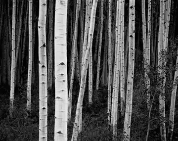

# 我用什么才能留住你  
**作者：博尔赫斯**

我给你瘦落的街道 绝望的落日 荒郊的月亮    
我给你一个久久地望着孤月的人的悲哀

我给你我已死去的祖辈 后人们用大理石祭奠的先魂   
我父亲的父亲 阵亡于布宜诺斯艾利斯的边境   
两颗子弹射穿了他的胸膛   
死的时候蓄着胡子 尸体被士兵们用牛皮裹起   
我母亲的祖父 那年才二十四岁   
在秘鲁率领三百人冲锋   
如今都成了消失的马背上的亡魂

我给你我的书中所能蕴含的一切悟力   
以及我生活中所能有的男子气概和幽默   
我给你一个从未有过信仰的人的忠诚   

我给你我设法保全的我自己的核心   
不营字造句，不和梦交易   
不被时间、欢乐和逆境触动的核心。   

我给你早在你出生前多年的一个傍晚看到的   
一朵黄玫瑰的记忆   
我给你关于你生命的诠释 关于你自己的理论   
你的真实而惊人的存在   

我给你我的寂寞 我的黑暗 我心的饥渴   
我试图用困惑 危险 失败来打动你   

## 写在前面
这是我最喜欢的一首诗，第一次看到的时候觉得好美好美，然后一连读了很多遍。

我把它作为我这个专栏——诗和远方的封面，为什么要在我的站点设置诗歌这个板块呢？一来是我很喜欢现代诗，一些现代诗总能从灵魂深处给予我美的震撼，让我颤抖，或是暴力的抽象：

**杨树** 顾城  
> 我失去了一只臂膀，  
> 就睁开了一只眼睛。  

