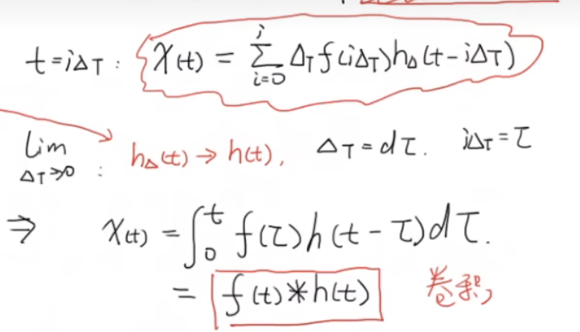

## PREPARATION

### Heterogeneity-Aware
通俗来说，毕竟不同车传感器不完全一样等等 leads to 异质性。

### Multimodal
- 单模态：e.g.自动驾驶中仅视觉
- 多模态：视觉，声音，文字，传感器数据

多模态过程：
- 单独特征提取：
- 特征融合：
- 得出结论：e.g.停车、加速、转向...

点云：点云是由激光雷达等传感器获取的三维空间中物体表面的点的集合。每个点包含了其在三维空间中的坐标信息（x, y, z）以及其他属性（如颜色、强度等）。点云数据广泛应用于自动驾驶、机器人导航和三维重建等领域。

### Federated Learning
传统的学习方法需要将用户数据上传到服务器进行学习，but数据属于用户。

联邦学习：一种分布式机器学习方法，允许多个设备或服务器在不共享原始数据的情况下协同训练模型。

即训练程序下发在客户端，客户端本地训练，上传模型参数，服务器端聚合。

- 横向联邦学习：各参与方拥有相同的特征空间但不同的样本空间。
- 纵向联邦学习：各参与方拥有相同的样本空间但不同的特征空间。
- 联邦迁移学习：将源领域的知识迁移到目标领域，适应目标领域的特征。 

## ABSTRACT

### complement
互补性的理解：自动驾驶车辆依赖多种传感器进行目标检测。不同传感器各有优缺点：
- 摄像头能提供丰富的视觉信息，但在光照或恶劣天气下性能下降。
- 激光雷达能提供精准的3D空间信息，但成本高、分辨率有限。
- 毫米波雷达能在雾、雨中工作，但空间分辨率低。
>While lidar and camera provide high-definition measurements in short distance due to attenuation in distance and degradation by adverse weather or lighting conditions, radar achieves relatively longer-range monitoring robust to adverse conditions, leveraging the penetrating power of radio waves.

so 多模态融合是关键。

### crowdsensing
众包感知（crowdsensing）是一种利用大量分布式传感器（通常是移动设备上的传感器）收集环境数据的方法。通过众包感知，系统可以获取更广泛、更丰富的数据，从而提高数据的准确性和覆盖范围。在自动驾驶中，众包感知可以帮助车辆共享环境信息，提高整体的感知能力和安全性。

### pseudo label
如果数据中有物体，但没有人工标注（label），传统训练会把它当背景 → 错误学习。

## INTRO

### two-stage method
两阶段方法：先生成候选区域，再对候选区域进行分类和回归。

bounding box regression: 对候选区域进行边界框回归，精确定位物体位置。

BEV: Bird's Eye View，鸟瞰图视角。通过将三维点云投影到二维平面，BEV提供了一种直观的方式来表示和理解场景中的物体位置和形状->for reduced complexity `as it reconciles the view discrepancy among different sensing modalities at a reasonably low cost.`

### Challenges

a variety of data heterogeneity

### loss function

to measure the D-value between predicted value and true value.

损失函数使用主要是在模型的训练阶段，每个批次的训练数据送入模型后，通过前向传播输出预测值，然后损失函数会计算出预测值和真实值之间的差异值，也就是损失值。得到损失值之后，模型通过反向传播去更新各个参数，来降低真实值与预测值之间的损失，使得模型生成的预测值往真实值方向靠拢，从而达到学习的目的。

## MOTIVATION 

简要言之，主要就是解决三种heterogeneity:
1. label
2. modality
3. environment

### DNN model
Deep Neural Network: 输入层 → 隐藏层1 → 隐藏层2 → ... → 输出层

每一层都由许多 **神经元（neurons）** 组成，每个神经元执行如下运算：

$$
z = w_1 x_1 + w_2 x_2 + \dots + w_n x_n + b
$$

然后通过一个 **非线性激活函数（Nonlinear Activation Function）**（如 ReLU、Sigmoid）：

$$
a = \sigma(z)
$$

多个这样的层堆叠起来 → 就形成了一个 **深度（Deep）网络**：

### Q: why AutoFed relies on AV clients?
1. data privacy
2. more visual cues can be leveraged locally on AVs

### backpropagating wrong gradients
some AV clients may label wrongly, leading to mistaken marks of these annotations(OD network may regard them as background), which means these wrong labels will 'pollute' the global model.

### precision and recall
Precision = TP / (TP + FP)  
Recall = TP / (TP + FN)

### PCA 
Principal Component Analysis (PCA) is a dimensionality reduction technique that transforms high-dimensional data into a lower-dimensional space.

e.g. 车的长度 车的高度 车的宽度 → 车的体积

### SYSTEM DESIGN

two-level design:  
1. a multimodal OD network to fully exploit the information provided by multimodal sensors  
2. an FL framework involving specifically designed loss, missing modality completion module, and client selection mechanism

### RPN
<https://zhuanlan.zhihu.com/p/106192020>

<https://zhuanlan.zhihu.com/p/31426458>

### Object Detection Basics

BCE: Binary Cross Entropy Loss

用于二分类问题，衡量预测概率与真实标签之间的差异。
$$
BCE(p, y) = -[y \cdot \log(p) + (1 - y) \cdot \log(1 - p)]
$$

| 符号  | 含义                          |
| --- | --------------------------- |
| $y$ | 真实标签（1表示有目标，0表示无目标）         |
| $p$ | 模型预测为“有目标”的概率（例如0.8表示80%确定） |

$L_{total} = L^{RPN}+L_{cls}+L_{reg}+L_{dir}$

| 名称        | 作用     | 类型         |
| --------- | ------ | ---------- |
| $L_{cls}$ | 分类误差   | BCE |
| $L_{reg}$ | 边框位置误差 | L1         |
| $L_{dir}$ | 朝向误差   | BCE |

#### Convolution

连续形式：

离散形式:
[【官方双语】那么……什么是卷积？](https://www.bilibili.com/video/BV1Vd4y1e7pj?vd_source=1aa7ad7fc948a86c9cdf4cac92c5838e)

#### L1 Loss Function

L1 损失（也叫 **绝对误差损失**，Mean Absolute Error, MAE）定义为：

$$
L_1 = |y - \hat{y}|
$$

其中：  
- \(y\)：真实值  
- \(\hat{y}\)：模型预测值  

pros: 对异常值相对不敏感 因为梯度始终为正负1
cons: 因为梯度恒定 所以训练可能不稳定 收敛慢

### Modality Alignment

voxelize the 3-D point

#### LiDAR vs Radar
https://zhuanlan.zhihu.com/p/377559130

LiDAR的工作流程如下：

1.  发射激光信号
2.  激光信号到达障碍物
3.  信号从障碍物反射
4.  信号返回到接收器
5.  记录一个激光脉冲

#### attention