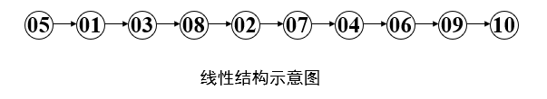

# 绪论

## 数据结构的基本概念
### 数据结构
计算机处理的数据元素的组织形式及其相互间的关系。由数据元素的有限集合及所有数据元素之间的关系组成。记为：Data_Structure={D,R}。  
其中，D(data)是数据元素的有限集，R(relationship)是所有数据元素之间的关系的有限集合。  

!!! example "线性结构"
    LINEARITY =（D,R）   
    D = { 01,02,03,04,05,06,07,08,09,10 }    
    R = { <05,01>,<01,03>,<03,08>,<08,02>, <02,07>,<07,04>,<04,06>,<06,09>,<09,10> }

    

### 存储结构
数据在计算机中的表示(或称映象）称为数据的存储结构，又称为物理结构。

四种基本存储方法：  
1. 顺序存储方法（顺序存储结构）  
2. 链接存储方法（链式存储结构）  
3. 索引存储方法  
4. 散列存储方法  

### 抽象数据类型(ADTs: Abstract  Data Types)
由用户定义，用以表示实际应用问题的数据模型。
由基本的数据类型组成, 并包括一组相关的服务（或称操作）。

#### 描述方法
抽象数据类型从形式上可用（D，R，O）三元组表示。其中：D是数据对象，R是D上的关系集，O是对D的基本操作集。

??? note "一般采用如下格式描述"
    ADT 抽象数据类型名 {   
       数据对象：〈数据对象的定义〉  
       数据关系：〈数据关系的定义〉  
       基本操作：〈基本操作的定义〉  
    } ADT 抽象数据类型名  

## 算法和算法分析
### 算法
1. 算法是用来解决某个特定问题的指令的集合。  
1. 算法是由人们组织起来准备加以实施的一系列有限的基本步骤。  

### [算法分析](https://www.hello-algo.com/chapter_computational_complexity/)
时间效率和空间效率是衡量算法优劣的两个主要评价指标，详见标题链接。

    

