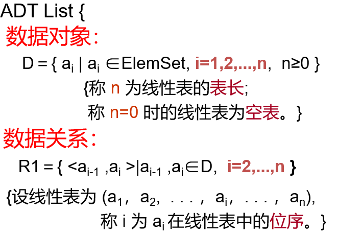

**定义:**

 $n(\ge 0)$个数据元素的有限序列，记作 $(a_1,a_2,……,a_n)$ 或 $(a_0,a_1,……,a_{n-1})$。

 $a_i$是表中数据元素，$n$ 是表长度。

??? note "抽象数据类型线性表的定义："
    

**特点:**

- 除第一个元素外，其他每一个元素有一个且仅有一个直接前驱。  
- 除最后一个元素外，其他每一个元素有一个且仅有一个直接后继。  
- 相邻数据元素之间存在序偶关系，“序偶”包含两层含义：顺序、配对。 

## 顺序表

## 链表
