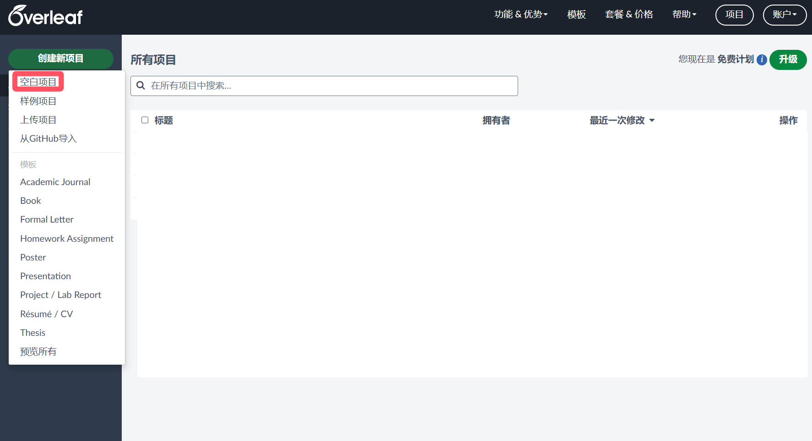
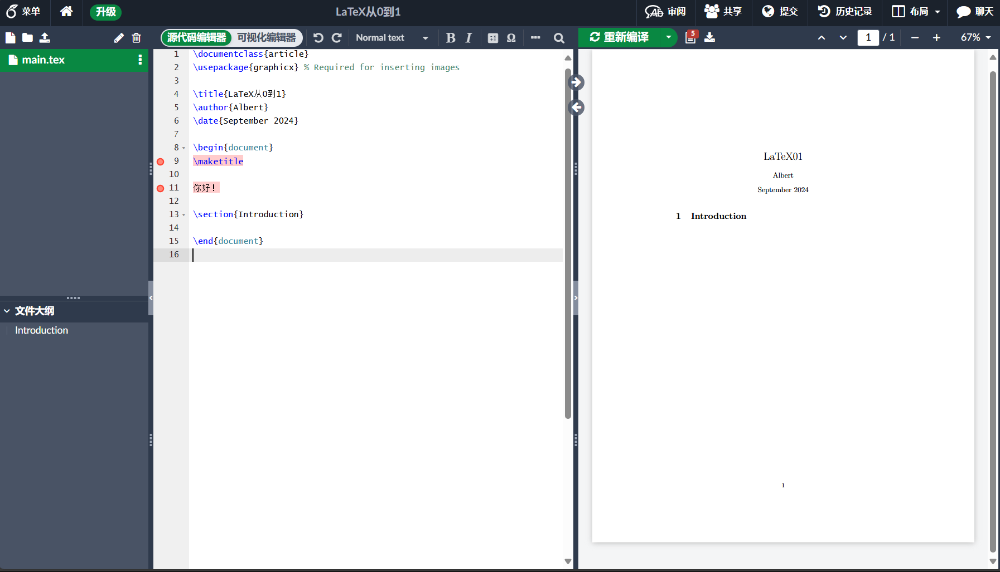

# 轻松写出第一篇文章

## `\begin{now}` 
看到这里，我默认大家已经配置好了环境，本篇教程会全程使用Overleaf演示。

## 创建自己的第一个`.tex`文件
在Overleaf个人主页的左上角点击创建新项目中的空白项目：



然后，就可以得到以下的页面：



如果你使用的是vscode或者TeXstudio，那么创建完`.tex`文件后可以将上述指令复制进去（鼠标悬浮在下面的代码块的右上角），然后编译文件并查看：
```latex
\documentclass{article}
\usepackage{graphicx} % Required for inserting images

\title{LaTeX从0到1}
\author{Albert}
\date{September 2024}

\begin{document}
\maketitle

你好！

\section{Introduction}

\end{document}

```
可能你会突然对这一些命令感到不知所措，也可能细心的你会发现中文没有在右侧显示出来，总之，你的右侧应该会渲染出和我相似的界面，我们慢慢往下看~

## 文档的基本结构

第一行`\documentclass{}`命令必须出现在每个LaTeX文件的开头，花括号内的文本指定了文档的类型，如果想要显示出中文，一种方法便是使用`ctexart`的文档类型:
```latex
\documentclass{ctexart}
```
我们用它来替换我们原先第一行的`\documentclass{article}`，重新编译后，右侧便能够显示出中文了。

??? question "为什么我没有编译成功？"
    这大概率是你没有使用XeLaTeX编译，对于含有中文的文档，我们需要使用XeLaTeX来编译。

    Overleaf中使用XeLaTeX编译的方法：
    
    1. 点击界面左上角的菜单
    2. 在**编译器**一栏中选择XeLaTeX

我们往下看看到`\begin{document}`那里，任何在`\begin{documnet}`之前的文本都被视为前导命令，会影响整个文档。任何在`\end{document}`之后的文本都会被忽视。而二者所包裹的，就是你的文本内容。

!!! success "恭喜你已经完成了LaTeX基本知识的学习！"

是的，你现在可以在`\begin{documnet}`和`\end{document}`所包裹的部分随意书写~

但慢慢的你发现，事情没有这么简单，这样得到的文件和直接在记事本里写出来的东西有什么区别呢，我在word里还可以随便输入字体，学这个垃TeX干嘛，于是你：

1. 打开[Word](https://www.kfc.com.cn/kfccda/index.aspx)
2. 继续学习[LaTeX](ez2.md)

    


    