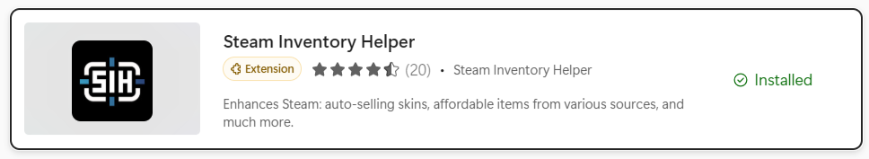

## 如何在Steam市场中批量上架CS2物品

### Steam市场自带功能

详见此文：[Steam市场自带功能：批量出售CSGO物品（仍需手动确认）](https://www.bilibili.com/opus/425911741880561706)

>不过要注意，不支持所有CSGO物品，只支持武器箱、胶囊、贴纸（印花）、钥匙和通行证等，武器皮肤和探员皮肤目前不支持

### 使用浏览器插件

浏览器扩展搜索Steam Inventory Helper并下载



具体使用可以参考本视频：[steam市场批量上架、下架插件（不限游戏、不限物品）](https://www.bilibili.com/video/BV1EWkFY1EQW/?vd_source=43e2d4749354273e9255f0d945164b6d)

## 如何批量令牌确认（移动端）

### 自己一个一个点
用手一个一个点过去就好了()


### 使用`Auto.js`创建脚本

[autojs官网](http://www.autojs.cc/)

我们可以下载免费版，然后创建脚本文件，内容如下：

```javascript
depth(24).untilFind().click();
```
打开确认界面，运行脚本即可自动全选，最后确认即可。

具体使用可以参考本视频：[【Auto.js】确认移动端Steam库存上架麻烦？全选！](https://www.bilibili.com/video/BV1T28EzfE9m/?spm_id_from=333.1365.list.card_archive.click&vd_source=f4e3b1f718dfdee38660bf6802836943)

#### 可能碰到的问题:
在授予无障碍权限时，可能会碰到`受限制的设置：出于安全考虑，此设置目前不可用`类似的字样，总之无法授予权限。

解决方法可以参考：[安卓无障碍允许受限制的设置](https://www.bilibili.com/opus/1006596087724638210#:~:text=%E6%9B%B4%E6%96%B0%E5%BA%94%E7%94%A8%EF%BC%8C%E8%AE%BE%E7%BD%AE%E5%AE%89%E5%8D%93%E7%9A%84%E8%BE%85%E5%8A%A9%E5%8A%9F%E8%83%BD%E7%9A%84%E6%97%A0%E9%9A%9C%E7%A2%8D%E6%9D%83%E9%99%90%E6%97%B6%EF%BC%8C%E9%81%87%E5%88%B0%E6%8F%90%E7%A4%BA%E2%80%9C%E5%8F%97%E9%99%90%E5%88%B6%E7%9A%84%E8%AE%BE%E7%BD%AE%E2%80%9D%20%E2%80%9C%E5%87%BA%E4%BA%8E%E5%AE%89%E5%85%A8%E8%80%83%E8%99%91%EF%BC%8C%E6%AD%A4%E8%AE%BE%E7%BD%AE%E7%9B%AE%E5%89%8D%E4%B8%8D%E5%8F%AF%E7%94%A8%E3%80%82%20%E2%80%9D%E5%87%BA%E7%8E%B0%E5%9C%A8%E5%8D%B8%E8%BD%BD%E5%BA%94%E7%94%A8%E9%87%8D%E8%A3%85%E5%90%8E%E3%80%82%20%E9%82%A3%E4%B9%88%E9%81%87%E5%88%B0%E8%BF%99%E7%A7%8D%E6%83%85%E5%86%B5%E8%AF%A5%E6%80%8E%E4%B9%88%E5%A4%84%E7%90%86%E5%91%A2%EF%BC%9F,%E9%95%BF%E6%8C%89%E5%BA%94%E7%94%A8%E5%9B%BE%E6%A0%87%EF%BC%8C%E7%82%B9%E5%BA%94%E7%94%A8%E4%BF%A1%E6%81%AF%E7%9A%84%E5%9B%BE%E6%A0%87%EF%BC%8C%E5%88%B0%E8%87%AA%E5%8A%A8%E7%82%B9%E5%87%BB%E5%99%A8%E3%80%90%E5%BA%94%E7%94%A8%E4%BF%A1%E6%81%AF%E9%A1%B5%E3%80%91%E3%80%82%20%E9%A1%B5%E9%9D%A2%E6%9C%80%E4%B8%8B%E8%BE%B9%E7%82%B9%E5%87%BB%E3%80%90%E6%9B%B4%E5%A4%9A%E3%80%91%E6%8C%89%E9%92%AE%EF%BC%88%E4%B8%80%E8%88%AC%E6%98%AF%E4%B8%89%E4%B8%AA%E7%82%B9%E5%9B%BE%E6%A0%87%EF%BC%89%E3%80%82%20%E7%82%B9%E5%87%BB%E3%80%90%E5%85%81%E8%AE%B8%E5%8F%97%E9%99%90%E5%88%B6%E7%9A%84%E8%AE%BE%E7%BD%AE%E3%80%91%20%E5%A6%82%E6%AD%A4%E5%B0%B1%E5%8F%AF%E4%BB%A5%E4%BA%86%E3%80%82)

以及不同机型操作方法会略有不同，建议关键词搜索：`手机机型 + 如何给app开启无障碍服务`